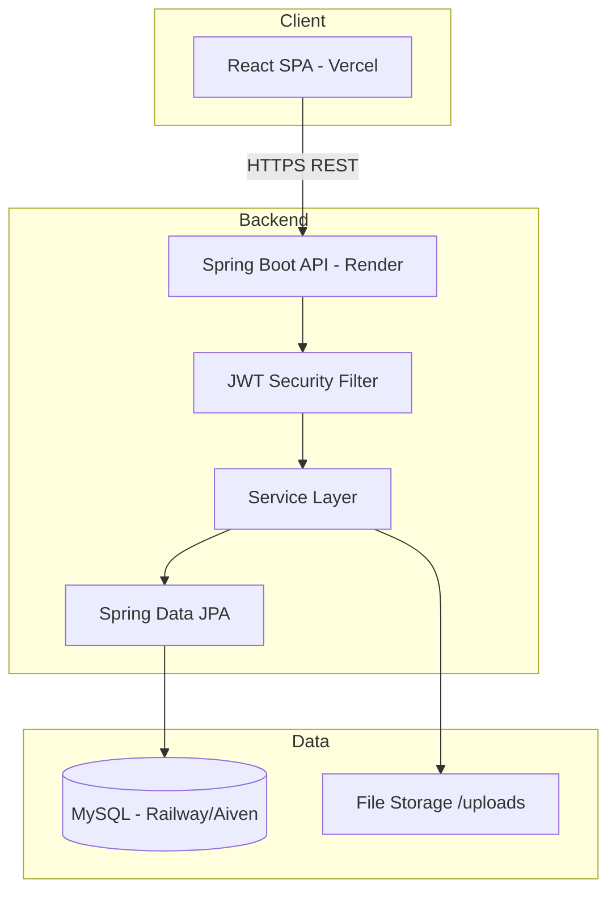
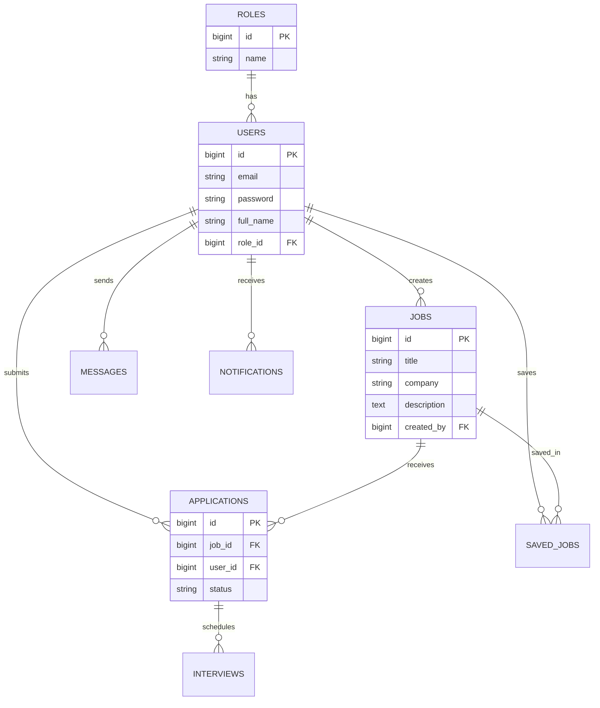
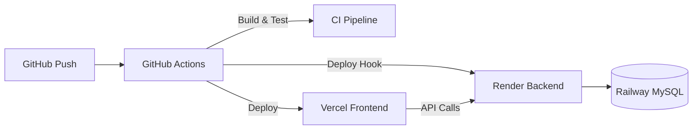

# Architecture

## System Overview



## Backend Layers

```
controller/   → REST endpoints, validation
service/      → Business logic
repository/   → JPA data access
model/        → JPA entities
dto/          → Request/response objects
security/     → JWT, UserDetails
config/       → Security, CORS, data seeding
exception/    → Global error handling
```

## Frontend Layers

```
pages/        → Route-level views
components/   → Reusable UI (Navbar, JobCard, etc.)
context/      → Auth & Theme state
services/     → Axios API client
```

## Database ER Diagram



## Authentication Flow

1. User logs in → `AuthService` validates credentials
2. `JwtService` generates signed token (HS256, 24h)
3. Frontend stores token in `localStorage`
4. Axios interceptor adds `Bearer` header
5. `JwtAuthenticationFilter` validates on each request
6. `@PreAuthorize` enforces role-based access

## Deployment Architecture


