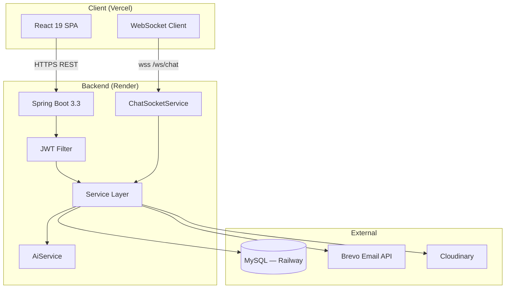
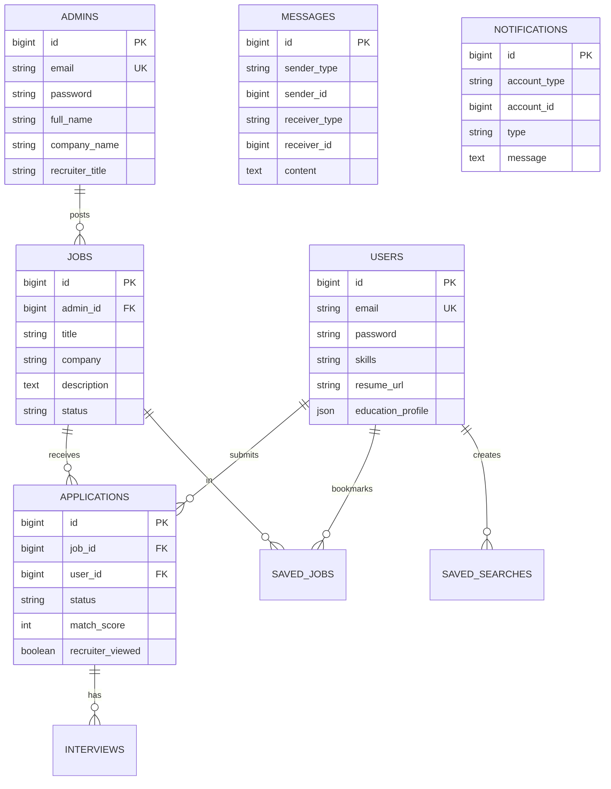
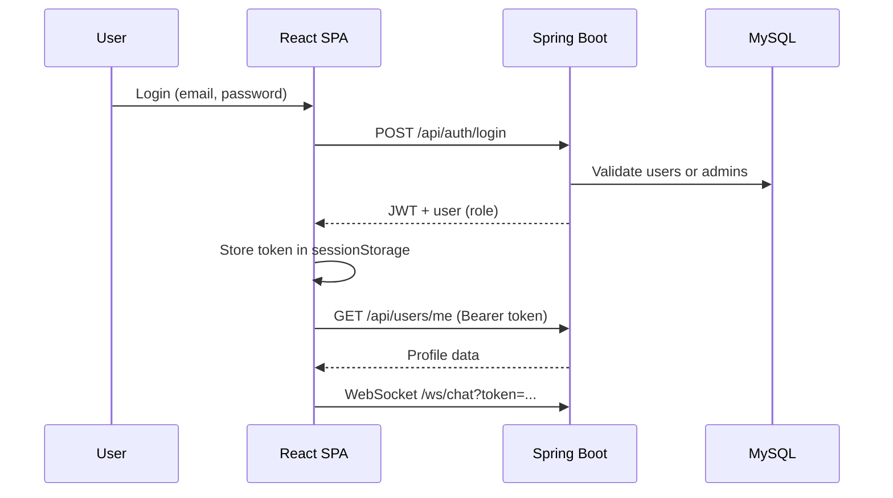
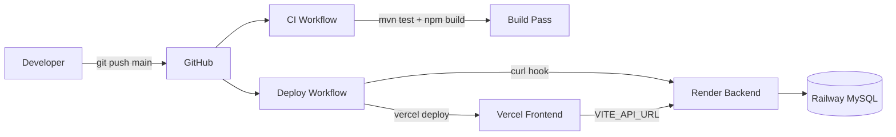

# Architecture

System design for the Job Board platform — React SPA, Spring Boot API, MySQL, deployed on Vercel + Render.

---

## System overview



---

## Backend layers

```
controller/     REST endpoints, @Valid, @PreAuthorize
service/        Business logic, transactions
repository/     Spring Data JPA
model/          JPA entities (User, Admin, Job, …)
dto/            Request/response objects
mapper/         Entity ↔ DTO conversion
security/       JWT, SecurityUtils, filters
config/         Security, CORS, schema migrations, data repair
websocket/      ChatWebSocketHandler, JWT handshake
util/           RecruiterCompanyUtils
exception/      GlobalExceptionHandler
```

---

## Frontend layers

```
pages/          Route-level views (Home, Jobs, Dashboard, Admin, …)
components/     Reusable UI (Navbar, JobCard, ChatPanel, …)
components/ui/  Design system (Pagination, EmptyState, Skeletons)
context/        AuthContext, ThemeContext
services/       Axios API client, WebSocket, auth storage
utils/          Formatters, recruiter company resolution, branding
```

---

## Database model (current)

Candidates and recruiters live in **separate tables**. Legacy `database/schema.sql` used a single `users` + `roles` model; runtime uses `users` + `admins` with Hibernate `ddl-auto: update` and `LegacySchemaMigration` for upgrades.



**Polymorphic messaging:** `sender_type` / `receiver_type` are `ADMIN` or `USER` — no single FK to one account table.

---

## Authentication flow



1. `AuthService` validates credentials against `users` or `admins`
2. `JwtService` signs token (HS256, 24h expiry)
3. Frontend stores token in **sessionStorage** (supports admin + candidate in separate tabs)
4. Axios interceptor adds `Authorization: Bearer <token>`
5. `JwtAuthenticationFilter` validates on each request
6. `@PreAuthorize("hasRole('ADMIN')")` enforces recruiter-only endpoints

---

## Security model

| Layer | Mechanism |
|-------|-----------|
| Transport | HTTPS (Vercel + Render) |
| Auth | Stateless JWT, BCrypt passwords |
| Authorization | Role-based — `ROLE_USER` vs `ROLE_ADMIN` |
| Privacy | Candidate PII masked until `recruiterViewed=true` |
| Messaging | Recruiter initiates; candidate replies only after first message |
| CORS | `CORS_ORIGINS` env var on backend |
| Files | Auth required for `/api/files/**`; resumes local, avatars Cloudinary |

Public endpoints: `/api/auth/**`, `/api/public/**`, `GET /api/jobs/**`, `GET /api/companies/**`, `/ws/**`

---

## Deployment architecture



| Component | Technology |
|-----------|------------|
| Frontend host | Vercel (Vite build, SPA rewrites) |
| Backend host | Render (Docker, `backend/Dockerfile`) |
| Database | Railway / Aiven MySQL 8 |
| Email | Brevo HTTP API |
| CI/CD | GitHub Actions |

---

## Startup & schema repair

On every backend boot:

| Runner | Purpose |
|--------|---------|
| `LegacySchemaMigration` (Order 0) | Migrate legacy schema; fix notifications/messages columns |
| `JobDataRepair` (Order 1) | Fix jobs with invalid `admin_id` |
| `CompanyDataRepair` (Order 2) | Clear legacy placeholder company names |

Hibernate `ddl-auto: update` adds new columns/tables automatically.

---

## Related documentation

- [WORKFLOWS.md](WORKFLOWS.md) — end-to-end user journeys
- [API.md](API.md) — REST endpoints
- [DEPLOYMENT.md](DEPLOYMENT.md) — production setup
