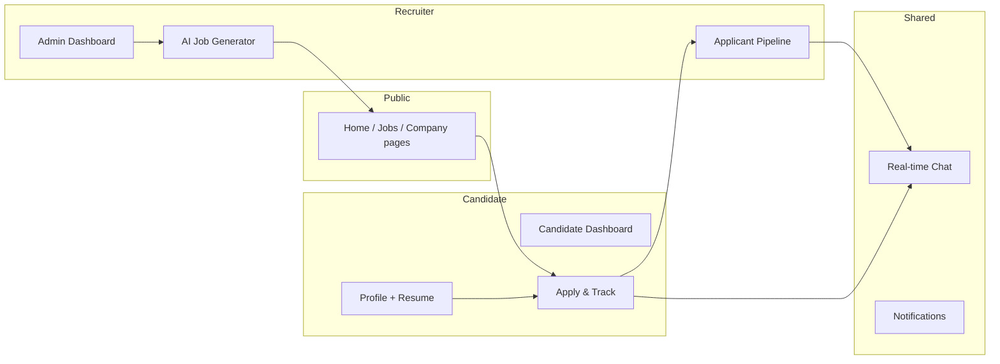
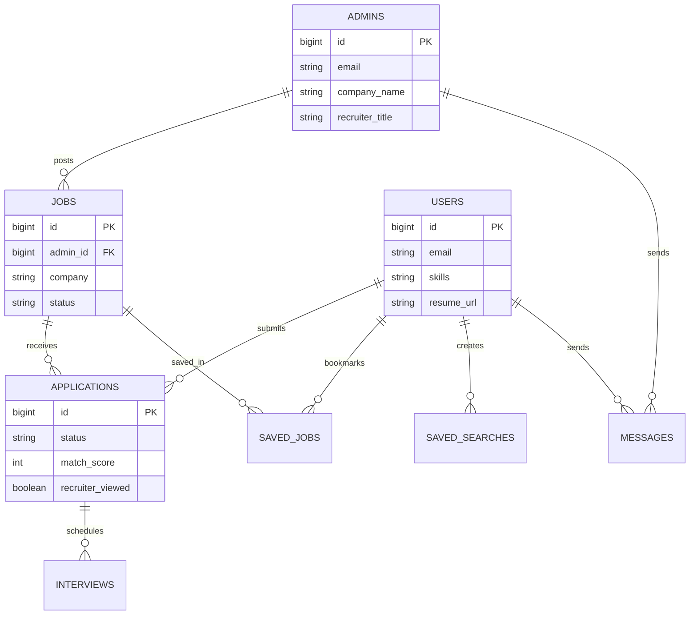

# End-to-End Workflows

This document describes how the Job Board platform works from a user and system perspective — from sign-up through job posting, applications, messaging, and deployment.

**Live references**

| Service | URL |
|---------|-----|
| GitHub | https://github.com/manisai03/Globalco |
| Backend API | https://globalco-job-board-api-vpee.onrender.com |
| Frontend (Vercel) | Add your Vercel production URL after deploy |

---

## 1. Platform overview



| Role | Database table | JWT role | Default landing |
|------|----------------|----------|-----------------|
| Candidate | `users` | `ROLE_USER` | `/dashboard` |
| Recruiter | `admins` | `ROLE_ADMIN` | `/admin` |

Recruiters and candidates are stored in **separate tables**. Each recruiter only sees their own jobs and applicants.

---

## 2. Authentication workflow

### 2.1 Registration

```
/register → choose Candidate or Recruiter → POST /api/auth/register → /login
```

| Account type | Required fields | Result |
|--------------|-----------------|--------|
| **Candidate** | email, password, full name | Row in `users` |
| **Recruiter** | + company name, role/title | Row in `admins` |

- Recruiters must enter a **real company name** (e.g. XPO). Placeholder names like "Globalco Technologies" are rejected.
- Password is hashed with BCrypt on the server.
- No auto-login after registration — user is redirected to login.

### 2.2 Login & session

```
/login → POST /api/auth/login → JWT (24h) stored in sessionStorage → GET /api/users/me
```

1. User submits email + password.
2. Backend validates against `users` or `admins` and returns `{ token, user }`.
3. Frontend stores the token and attaches `Authorization: Bearer <token>` to all API calls.
4. On 401, storage is cleared and user is sent to `/login`.
5. WebSocket chat connects automatically after login (`/ws/chat?token=...`).

### 2.3 Forgot password (OTP)

```
/forgot-password → POST /api/auth/forgot-password → email OTP (10 min)
                → POST /api/auth/reset-password → /login?reset=true
```

OTP is delivered via **Brevo** (HTTP API on Render; SMTP locally). See [DEPLOYMENT.md](DEPLOYMENT.md) for `BREVO_API_KEY` setup.

### 2.4 Route protection

| Route | Access |
|-------|--------|
| `/`, `/jobs`, `/jobs/:id`, `/companies/:id`, `/login`, `/register`, `/forgot-password` | Public |
| `/dashboard`, `/profile`, `/chat`, `/notifications` | Authenticated |
| `/admin` | Recruiter only (`ROLE_ADMIN`) |

---

## 3. Candidate workflow

### 3.1 Discover jobs

**Pages:** `/` (home), `/jobs` (browse), `/jobs/:id` (detail), `/companies/:adminId` (employer page)

```
User opens /jobs → GET /api/jobs?search&location&jobType&...&page&size
                 → filters sync to URL (shareable links)
                 → split-pane preview on large screens (?job=<id>)
```

| Action | API | Notes |
|--------|-----|-------|
| Search & filter | `GET /api/jobs` | Paginated, sortable |
| Featured jobs | `GET /api/jobs/featured` | Home page |
| Recommendations | `GET /api/jobs/recommended` | Skill overlap when logged in |
| Similar jobs | `GET /api/jobs/{id}/similar` | Job detail sidebar |
| Company profile | `GET /api/companies/{adminId}` | Linked from job cards |
| Save job | `POST /api/saved-jobs/{id}` | Requires login |
| Match preview | Included in job response | When candidate is logged in |

### 3.2 Build profile (Naukri-style)

**Pages:** `/profile` or `/dashboard?tab=profile`

```
GET /api/users/me → edit sections → PUT /api/users/me
                  → POST /api/users/me/resume (PDF/DOC)
                  → POST /api/users/me/avatar (Cloudinary)
```

Profile sections: headline, skills, education, internships, employment, open-to-work, location. A completion ring encourages filling all sections. Resume + skills directly affect **AI match score** on apply.

### 3.3 Apply for a job

```
/job/:id → Easy Apply → POST /api/applications/jobs/{jobId} (multipart)
         → match score computed → notification to recruiter
         → appears in /dashboard (Applications tab)
```

| Step | Detail |
|------|--------|
| Preconditions | Job status `OPEN`; candidate not already applied |
| Resume | Uses upload on apply, or profile resume if none |
| Match score | 0–100 based on skills, location, profile completeness, early applicant bonus |
| Status | Starts as `PENDING` |
| Withdraw | `DELETE /api/applications/{id}` → `WITHDRAWN` |

### 3.4 Track applications & interviews

**Dashboard tabs:** Applications · Interviews · Saved Jobs · Job Alerts

| Tab | API | Content |
|-----|-----|---------|
| Applications | `GET /api/applications/me` | Status badges, match score, withdraw |
| Interviews | `GET /api/applications/interviews/me` | Scheduled interviews (when recruiter creates them) |
| Saved Jobs | `GET /api/saved-jobs` | Bookmarked listings |
| Job Alerts | `GET /api/saved-searches` | Saved filter presets + live match count |

**Job alerts:** Save current `/jobs` filters via `POST /api/saved-searches`. Shows how many open jobs match; no automated email yet.

### 3.5 Messaging (candidate side)

```
Recruiter views application → recruiter sends first message
→ candidate can reply in /dashboard?tab=messages or /chat
```

- Candidates **cannot** cold-message recruiters.
- Contact names stay masked until the recruiter has viewed the application.
- Real-time delivery via WebSocket; polling fallback every 5s if disconnected.

---

## 4. Recruiter workflow

### 4.1 Onboarding & company setup

```
/register (Recruiter) → /admin → Profile tab → set Company Name, website, description
```

Company name flows into:
- Job postings (`POST /api/jobs`)
- AI job descriptions (`POST /api/ai/generate-job-description`)
- Public company page (`/companies/{adminId}`)
- Chat contact labels

Use **Sync from profile** on the Jobs / AI tabs to refresh the company field.

### 4.2 Post a job (manual or AI-assisted)

**Option A — AI Generator tab**

```
/admin?tab=ai → enter title, skills, location → POST /api/ai/generate-job-description
              → description pre-fills Jobs form → review → POST /api/jobs
```

**Option B — Jobs tab directly**

```
/admin?tab=jobs → fill form → POST /api/jobs
```

| Field | Source |
|-------|--------|
| Company | Profile `companyName` or form (legacy placeholders ignored) |
| Description | Manual or AI-generated markdown |
| Skills | Comma-separated; used for match scoring |
| Featured | Highlights on home page |

Edit: `PUT /api/jobs/{id}` · Delete: `DELETE /api/jobs/{id}`

### 4.3 Review applicants (privacy-first)

```
Applicant applies → GET /api/admin/applicants (masked: "Candidate #42")
                 → open application detail → GET /api/applications/{id}
                 → recruiterViewed=true → full name, email, resume revealed
```

| Masked until viewed | Revealed after view |
|-----------------------|---------------------|
| Name, email, phone | Full candidate profile |
| Resume, cover letter | Downloadable via `/api/files/...` |
| Skills, location | Match breakdown |

**Status pipeline** (`PATCH /api/applications/{id}/status`):

```
PENDING → SHORTLISTED → INTERVIEW_SCHEDULED → HIRED
                    ↘ REJECTED
```

### 4.4 Message candidates

```
View application → /admin?tab=messages&userId=<candidateId> → POST /api/messages
```

Recruiter must view the application before messaging. Candidate receives a notification and can reply.

### 4.5 Analytics

**Overview tab** — `GET /api/admin/dashboard`

- Total jobs, applications, unique candidates
- Applications per job (bar chart)
- Status breakdown (donut chart)
- Applications by category, monthly trend

**Period analytics** — `GET /api/admin/analytics/applications?period=week|month|year`

---

## 5. AI features workflow

### 5.1 Job description generator

| Input | `jobTitle`, `skills`, `company`, `location`, `experienceLevel` |
| Output | Professional markdown description |
| Engine | Template-based (`AiService`); OpenAI optional via `OPENAI_ENABLED=true` |
| Access | Recruiter only — `/api/ai/generate-job-description` |

### 5.2 Resume match score

Computed on **apply** and shown as **preview** when browsing jobs (logged-in candidates).

| Factor | Weight |
|--------|--------|
| Base | 35 points |
| Skills match (≥50% overlap) | +30 |
| Partial skill overlap | Proportional share of 30 |
| Location match (incl. remote) | +15 |
| Profile complete (skills + resume) | +10 |
| Early applicant (≤7 days, <20 applicants) | +10 |

Score is capped at 100 and stored on `applications.match_score`.

---

## 6. Notifications workflow

Notifications are **polled** (navbar every 10s + on window focus), not push/WebSocket.

| Event | Recipient |
|-------|-----------|
| New application | Recruiter |
| Application submitted | Candidate (confirmation) |
| Status change | Candidate |
| Interview scheduled | Candidate |
| New message | Receiver |
| Job posted | Recruiter (optional) |

API: `GET /api/notifications`, `PATCH /api/notifications/{id}/read`, `PATCH /api/notifications/read-all`

---

## 7. Real-time chat workflow

```
Login → WebSocket connect ws://<api>/ws/chat?token=<JWT>
      → POST /api/messages → ChatSocketService pushes to both sessions
      → ChatPanel updates; navbar unread count refreshes
```

Handshake validates JWT and maps session to `ADMIN:{id}` or `USER:{id}`.

---

## 8. Data model (current)



Messages and notifications use polymorphic `(account_type, account_id)` — no FK to a single user table (supports both admins and candidates).

Startup repair: `LegacySchemaMigration` + `CompanyDataRepair` fix schema drift and legacy placeholder company names.

---

## 9. CI/CD & deployment workflow

```
Developer pushes to main
    → GitHub Actions CI (build + test backend & frontend)
    → Deploy workflow
        → curl RENDER_DEPLOY_HOOK (backend redeploy)
        → vercel deploy --prebuilt (frontend)
```

| Component | Host | Config |
|-----------|------|--------|
| Frontend | Vercel | Root: `frontend`, `VITE_API_URL` |
| Backend | Render | `render.yaml`, Docker, MySQL env vars |
| Database | Railway / Aiven | MySQL 8 |
| Email | Brevo | `BREVO_API_KEY`, `MAIL_FROM` |
| Avatars | Cloudinary | Optional env vars |

Full steps: [DEPLOYMENT.md](DEPLOYMENT.md) · Assessment checklist: [SUBMISSION.md](SUBMISSION.md)

---

## 10. Complete journey examples

### Candidate: search → apply → track

1. Visit `/jobs`, filter by "Java" + "Hyderabad"
2. Open job preview, click **Easy Apply**
3. System computes match score (e.g. 78%)
4. Track status in `/dashboard` → Applications
5. Recruiter shortlists → notification appears
6. Recruiter messages → reply in Messages tab

### Recruiter: post → review → hire

1. Set company **XPO** in Profile
2. `/admin?tab=ai` → generate Java Developer description
3. Post job → appears on `/jobs` and `/companies/{yourId}`
4. Candidate applies → masked in Applicants tab
5. Open application → identity revealed, read resume
6. Message candidate → set status to **SHORTLISTED** → **HIRED**

---

## Related documentation

| Doc | Focus |
|-----|-------|
| [FEATURES.md](FEATURES.md) | Feature inventory |
| [API.md](API.md) | REST endpoint reference |
| [ARCHITECTURE.md](ARCHITECTURE.md) | System design & layers |
| [AI_USAGE.md](AI_USAGE.md) | How Cursor AI built the project |
| [DEPLOYMENT.md](DEPLOYMENT.md) | Production setup |
| [SUBMISSION.md](SUBMISSION.md) | Assessment submission links |
